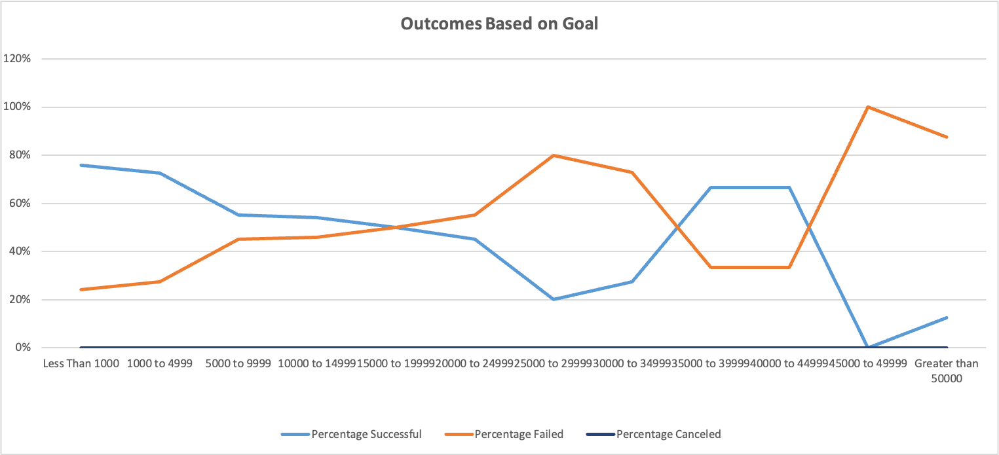
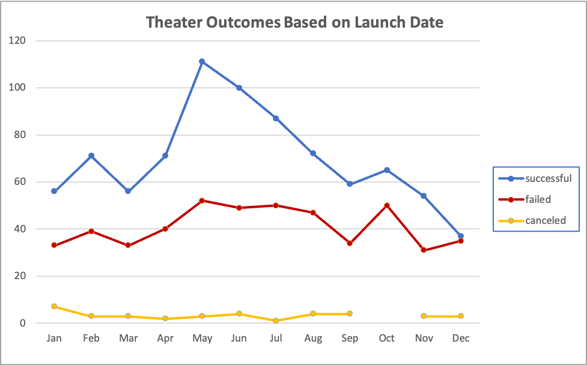

# Kickstarter Analysis

## Overview

This analysis was completed to show if correlations exist between campaign outcomes and when they were launched, as well as what the campaigns funding goal and if that added to the success or failure of a campaign. 

---

## Analysis

* The analysis is derived from a data set containing theater plays that had a outcome of either successful, failed, or canceled with a funding goal of between $0-$50000

 
* Keeping these same outcomes as a parameter, the following chart indicates which month these campaigns launched based off of launch dates that spanned a 9 year period (2009-2017).

 

---

## Results

### Outcomes Based on Goals

* Based off of the outcomes of successful, failed, and canceled with the funding goals for each campaign the data shows that the most successful theater campaigns had a funding goal range between $0-$4999.  Around 75% of these campaign succeeded and around 25% failed, none were canceled.  The campaigns with funding goals of $5000 or higher had less success than the ones with funding goals at $4999 or less.

### Theater Outcomes by Launch Date

* Based off of the outcomes in relation to when a campaign was launched the data shows that the months of May and June had the highest number of successful campaigns compared to other months.  For most months of the year there were more successful campaigns than failed ones.

### Summary of limitations

* There is not enough data given to get a really good analysis on what could potential increase Louise's success for her campaign.  For example, when did she launch her campaign?  We should also look closer at the plays that had a similar goal to hers and see when those plays launched their compaigns.  A line chart could be created to represent only campaigns with a goal of $12,000 - $15,000 and when they launched.  Those plays possibly have different launch months where they were the most succesful that differs from plays that had success with goals $5000 or less.  

